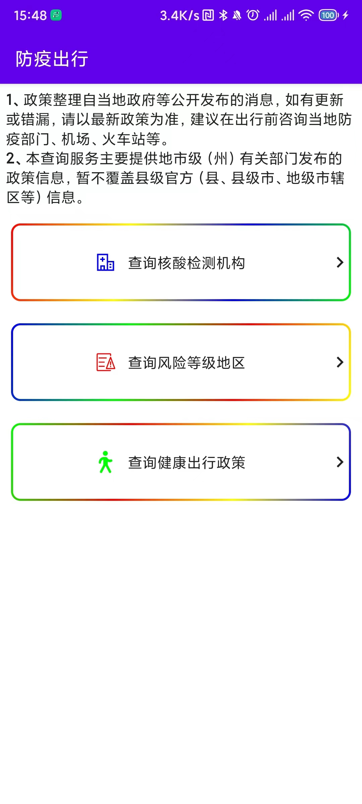
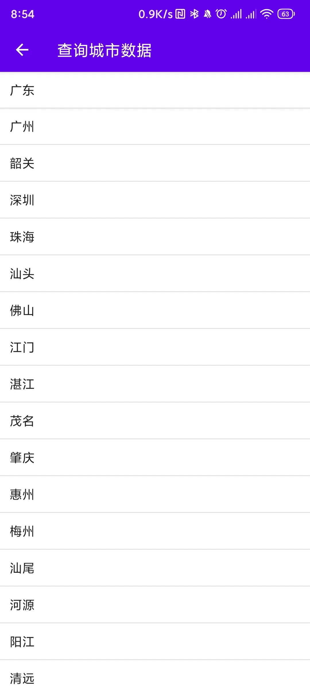
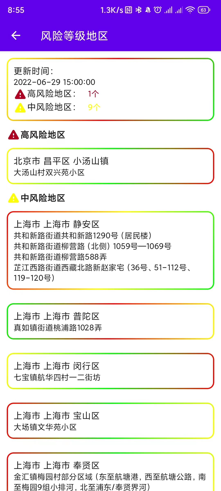
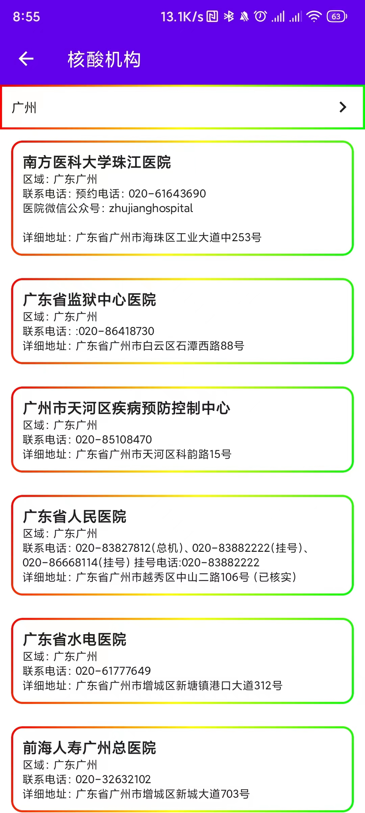

# 出行防疫

项目采用**Kotlin**语言编写，采用**Jetpack Compose**全新UI框架编写UI，运用了部分**Jetpack**组件</br>
[**Accompanist**](https://google.github.io/accompanist/)官方非正式组件库</br>
[**Coil**](https://github.com/coil-kt/coil)图片加载库</br>
[**Hilt**](https://developer.android.google.cn/jetpack/androidx/releases/hilt)依赖注入</br>
[**Navigation**](https://developer.android.google.cn/jetpack/androidx/releases/navigation)
单Activity架构</br>
[**Room**](https://developer.android.google.cn/jetpack/androidx/releases/room)用于保存城市数据</br>
[**Work**](https://developer.android.google.cn/jetpack/androidx/releases/work)后台任务</br>

# 截图欣赏

### 首页</br>



### 城市列表



### 风险地区



### 核酸机构



### 健康出行政策


# 其他

项目文档持续更新中

# License

```
MIT License

Copyright (c) 2022 PostLiu

Permission is hereby granted, free of charge, to any person obtaining a copy
of this software and associated documentation files (the "Software"), to deal
in the Software without restriction, including without limitation the rights
to use, copy, modify, merge, publish, distribute, sublicense, and/or sell
copies of the Software, and to permit persons to whom the Software is
furnished to do so, subject to the following conditions:

The above copyright notice and this permission notice shall be included in all
copies or substantial portions of the Software.

THE SOFTWARE IS PROVIDED "AS IS", WITHOUT WARRANTY OF ANY KIND, EXPRESS OR
IMPLIED, INCLUDING BUT NOT LIMITED TO THE WARRANTIES OF MERCHANTABILITY,
FITNESS FOR A PARTICULAR PURPOSE AND NONINFRINGEMENT. IN NO EVENT SHALL THE
AUTHORS OR COPYRIGHT HOLDERS BE LIABLE FOR ANY CLAIM, DAMAGES OR OTHER
LIABILITY, WHETHER IN AN ACTION OF CONTRACT, TORT OR OTHERWISE, ARISING FROM,
OUT OF OR IN CONNECTION WITH THE SOFTWARE OR THE USE OR OTHER DEALINGS IN THE
SOFTWARE.

```